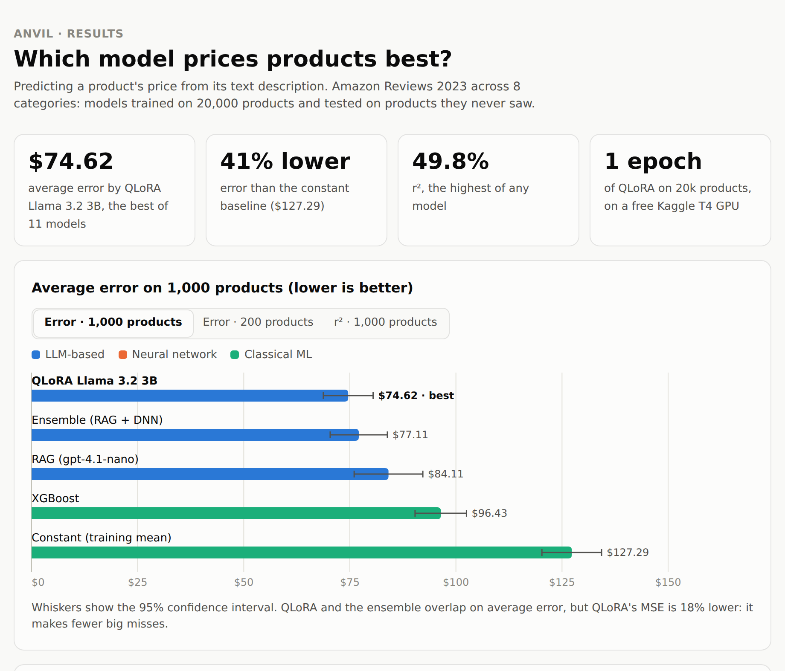

# Anvil: product price prediction and deal-hunting agents

Predict what a product costs from its text description, compare 11 ways of doing it on the same data, then use the best predictors inside a team of agents that scans online deals and sends a push notification when something is priced well below its estimated value.

Data: Amazon Reviews 2023 product metadata, 22,000 products across 8 categories (20,000 train, 1,000 validation, 1,000 test).



Interactive version: download [`docs/results.html`](docs/results.html) and open it in a browser.

## Results

Metric is average absolute error in dollars on held-out test products (lower is better). Models never see test items during training or retrieval.

### 1,000 test products

| Model | Avg. error | MSE | r² |
|---|---|---|---|
| Constant (training mean) | $127.29 | | |
| XGBoost | $96.43 | | |
| RAG (Chroma + frontier LLM) | $84.11 | | |
| Ensemble (RAG 89% + deep NN 11%) | $77.11 | 17,761 | 38.7% |
| **QLoRA Llama 3.2 3B** | **$74.62** (±5.87) | **14,550** | **49.8%** |

QLoRA is 41% better than the constant baseline, 23% better than XGBoost and has 18% lower MSE than the ensemble.

### 200 test products (all models except QLoRA)

| Model | Avg. error |
|---|---|
| Constant | $132.89 |
| Linear regression | $120.61 |
| Zero-shot GPT-4.1-nano | $119.79 |
| Deep residual NN (289M params) | $98.04 |
| Bag of words + linear regression | $96.36 |
| Random forest | $96.16 |
| XGBoost | $95.87 |
| MLP | $94.21 |
| RAG | $76.58 |
| Ensemble (RAG 89% + deep NN 11%) | $73.12 |

The 200-item and 1,000-item tables are different samples, so compare numbers only within a table. QLoRA was run only on the 1,000-item set, and it is not part of the ensemble.

## QLoRA fine-tune

| | |
|---|---|
| Base model | Llama 3.2 3B |
| Quantisation | 4-bit NF4 |
| Adapter | LoRA, r = 32 |
| Hardware | Kaggle T4 GPU, fp16 |
| Training | 1 epoch on the 20,000-item train split, about 7.5 hours |
| Evaluation | 1,000 held-out test items |
| Result | $74.62 average error (±5.87), MSE 14,550, r² 49.8% |

This is a single training run with one seed, so treat the gap to the ensemble as indicative, not final.

Reproduce: Kaggle notebook `<KAGGLE-NOTEBOOK-URL>` (saved run with output), adapter weights `<HF-ADAPTER-URL>`, raw predictions in `docs/qlora_1000_predictions.json`.

## Architecture

```
Amazon meta -> parse -> dedupe -> weighted sample -> LLM summaries -> prompt/completion pairs
                                                                              |
        baselines / XGBoost / deep NN        Chroma vector store (RAG)        QLoRA Llama 3.2 3B
                         \                           |
                          +-------- agents ----------+
RSS deal feeds -> ScannerAgent -> PlanningAgent -> EnsembleAgent (RAG + deep NN)
                                       |
                                       +-> MessagingAgent -> Pushover
```

## Layout

```
src/pricer/
├── config.py              env-driven settings and paths
├── data/
│   ├── items.py           Item model, prompt helpers, Hub push/pull
│   ├── parser.py          raw Amazon row → Item (cleaning, weight parsing)
│   ├── loaders.py         parallel category loading straight from the Hub jsonl files
│   ├── curate.py          dedupe, price-weighted sampling, splits
│   ├── summarize.py       LLM rewrites: Groq batch API or local/LiteLLM
│   ├── prompts.py         token-truncated prompt/completion pairs for SFT
│   └── store.py           local jsonl cache ⇄ HuggingFace Hub
├── evaluation.py          Tester: error, 95% CI, MSE, r², plotly charts
├── models/
│   ├── baselines.py       random, constant, linear, bag-of-words LR, random forest, XGBoost, human
│   ├── neural_network.py  8-layer MLP
│   ├── deep_neural_network.py   residual network (train, save, load, infer)
│   ├── frontier.py        zero-shot frontier LLMs via LiteLLM
│   ├── finetune_openai.py OpenAI fine-tuning job + predictor
│   └── qlora.py           QLoRA fine-tune of Llama 3.2 3B + local inference
├── rag.py                 Chroma index, similarity search, RAG prompt, t-SNE data
├── agents/                scanner, frontier, specialist, neural network, ensemble,
│                          messaging, planning, autonomous (tool-calling), framework
├── service.py             Modal GPU deployment of the fine-tuned model
├── app.py                 Gradio dashboard
└── cli.py                 `pricer` command
```

## Setup

```bash
python -m venv .venv && source .venv/bin/activate
pip install -e ".[all]"          # or pick extras: ml, batch, finetune, agents, dev
cp .env.example .env             # add your keys
```

Extras: `ml` (torch, xgboost) · `batch` (groq) · `finetune` (transformers, peft, trl, bitsandbytes) · `agents` (chromadb, sentence-transformers, modal, gradio, scraping) · `dev` (pytest, ruff).

By default datasets are read from the pre-built public ones (`PRICER_HF_SOURCE=ed-donner`), so you can skip straight to evaluation. Set `PRICER_HF_USER` to your own username to push datasets and adapters.

## Usage

Every command defaults to the lite dataset (20k train); add `--full` for 800k.

```bash
# 1. data (optional - pre-built datasets are on the Hub)
pricer curate --push                       # load 8 categories, dedupe, sample, split
pricer summarize submit                    # Groq batch API; later:
pricer summarize fetch --push              #   collect results (re-runnable, state in data/batches)
pricer summarize local --model groq/openai/gpt-oss-20b   # or rewrite synchronously via LiteLLM
pricer prompts --push                      # prompt/completion pairs for fine-tuning

# 2. models
pricer evaluate xgboost
pricer evaluate frontier --llm openai/gpt-4.1-nano
pricer evaluate frontier --llm gemini/gemini-3-pro-preview --reasoning-effort low --size 50 --workers 2
pricer train-dnn --full --epochs 5         # ~4h on an M1 GPU; weights → data/deep_neural_network.pth
pricer evaluate dnn --chart
pricer finetune-openai --train-size 100    # then: pricer finetune-openai --job ftjob-...
pricer evaluate openai-ft --llm ft:gpt-4.1-nano-...:pricer:...
pricer finetune-qlora --full --report-to wandb   # needs a CUDA GPU
pricer evaluate qlora

# 3. RAG + agents
pricer index --full                        # embed train items into data/products_vectorstore
pricer evaluate rag
make deploy                                # modal deploy -m pricer.service
pricer evaluate ensemble
pricer run                                 # one pass of the deal-hunting agents
pricer run --autonomous                    # LLM tool-calling planner instead
pricer app                                 # Gradio dashboard, re-runs every 5 minutes
```

The deep neural network weights from the course are at the link in the original week 6 notebook; drop the file at `data/deep_neural_network.pth`.

## Development

```bash
make test     # pytest, fully offline: APIs and models are faked
make lint     # ruff
make format
```

Tests cover the data pipeline, models and the tool-calling agents without network access.

Never commit `.env`. Keep API keys out of the repo and rotate any that have been pasted into notebooks or chats.
